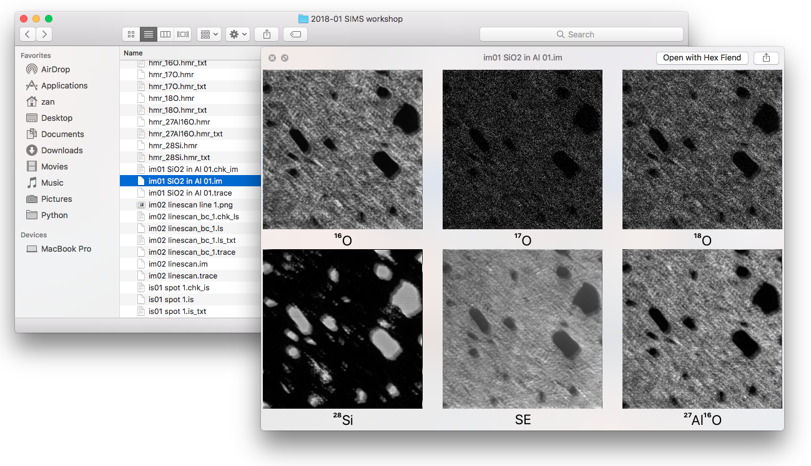
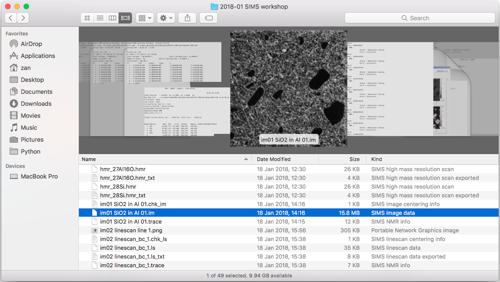
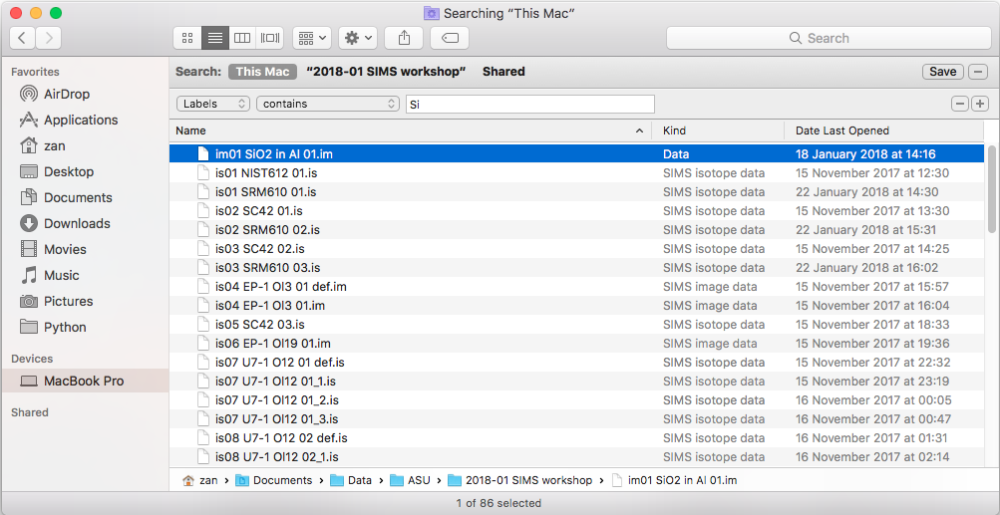
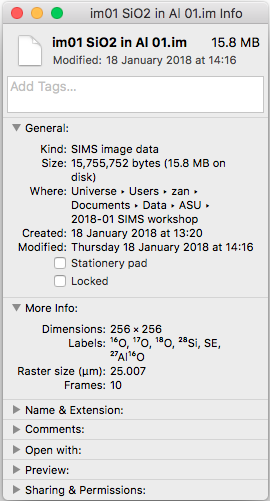
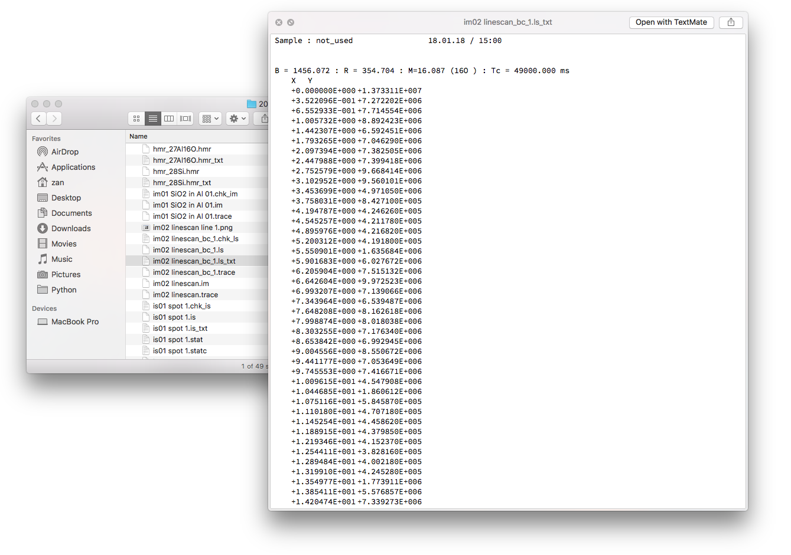

QuickLookSIMS
=============

With QuickLookSIMS you can preview Secondary Ion Mass Spectrometry (SIMS) files as generated by [Cameca instruments](http://www.cameca.com). QuickLook is the preview technology of macOS that allows you to quickly view any file directly from the Finder by hitting the space bar.

It also generates thumbnails for image (.im) files. QuickLookSIMS takes the first frame of the first mass in the file to generate a thumbnail.

In addition to a QuickLook generator, QuickLookSIMS also includes a Spotlight importer. With Spotlight, the search function on macOS, you now search for SIMS files based on specific properties, such as pixel dimension, raster size, number of masses, or element names.

The Spotlight importer also lets you display some basic information of a data file in the Get Info window (&#8984;-I).

Finally, as a nice side effect of the Spotlight importer, all the text-based files such as .chk\_im, .is\_txt, .trace, etc. are properly recognized as plain text files and you can open them by simply double-clicking. They will open in the standard text editor, which is TextEdit by default. Of course, you can still use right-click > Open with > Other to choose a different application.

Installation
============

Download the lastest installer here: [QuickLookSIMS.pkg](https://github.com/zanpeeters/QuickLookSIMS/dist/QuickLookSIMS.pkg). QuickLookSIMS requires macOS 10.7 or newer.

After installation, it may take a while before Spotlight has indexed your SIMS files. Close all Finder windows and wait a few minutes. If you still don't see any change after 5-10 min, you may need to force quit Finder (menu bar > Apple icon > Force Quit > Finder) or reboot your computer.

This package is not signed. If you get a warning about Gatekeeper, open System Preferences > Security & Privacy > General and allow this unsigned package to be installed.
